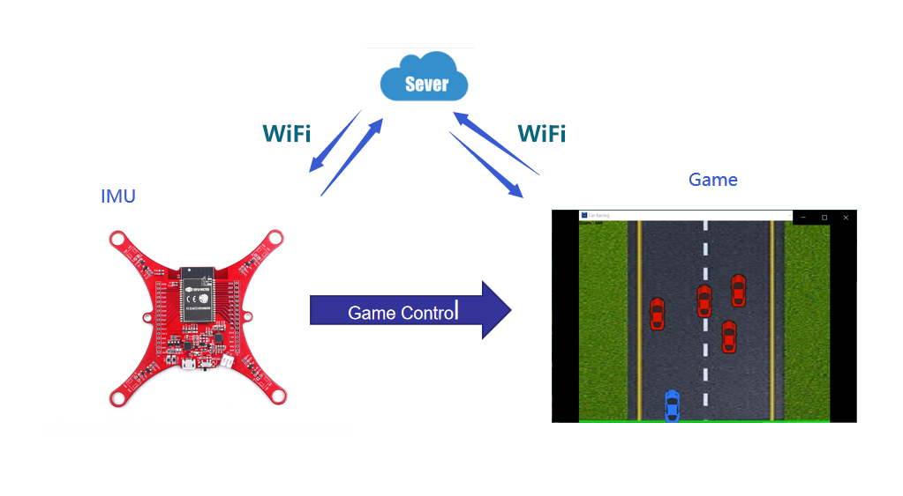
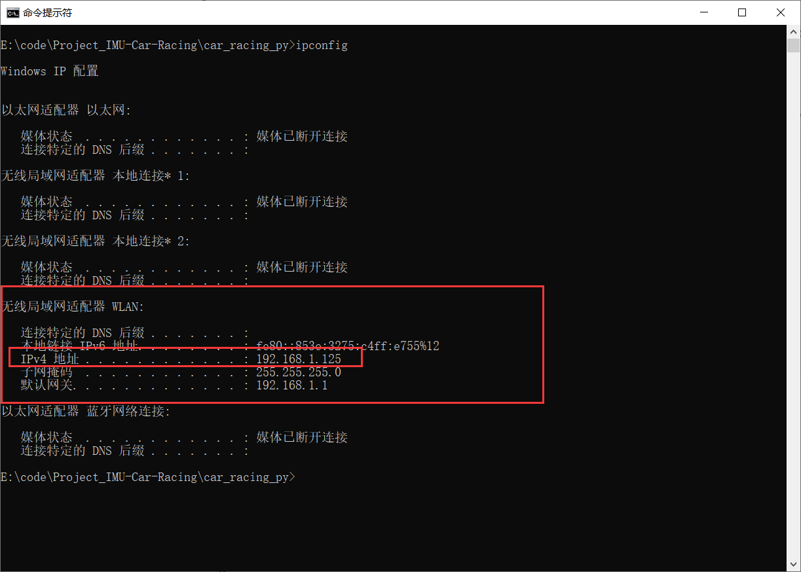
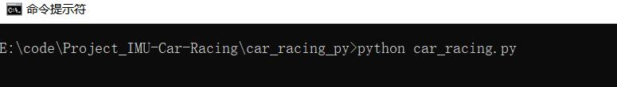
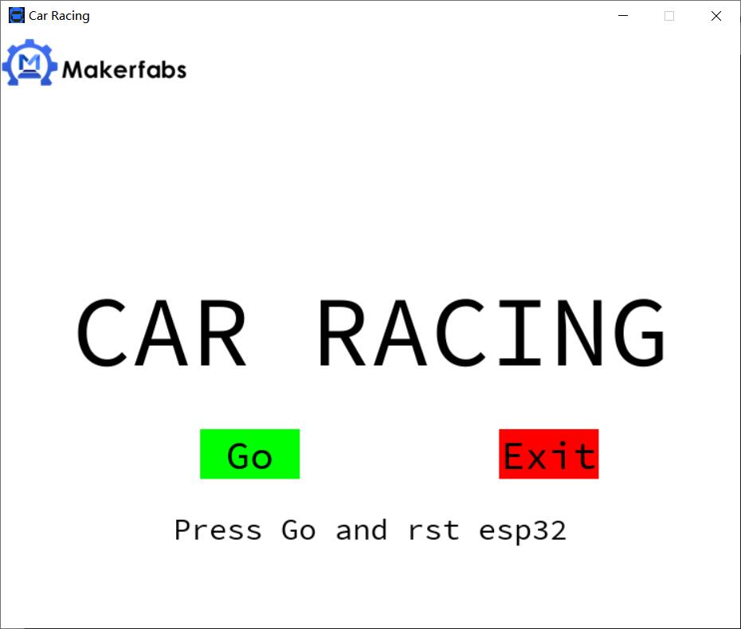

# Project_IMU-Car-Racing

```
/*
Version:		V1.1
Author:			Vincent
Create Date:	2020/8/6
Note：
```


[toc]

# Overview

[Makerfabs home page](https://www.makerfabs.com/)

[Makerfabs Wiki](https://makerfabs.com/wiki/index.php?title=Main_Page)


Using the MPU6050 gyroscope to obtain its own tilt Angle to simulate the arrow keys, the control of a simple Python racing game.Realized the car up and down left and right movement. This project is implemented entirely in Python.



# ESP32 IMU Module V1.1

## Product link ：[ESP32 6- Axis IMU](https://www.makerfabs.com/esp32-6-axis-imu.html) 

## Detail Info: [ESP32_IMU_Module](https://github.com/Makerfabs/ESP32_IMU_Module)

The Makerfabs IMU Module features the 6-axis MPU-6050 MEMS sensor from InvenSense. Each of these 6DoF IMU feature an ESP32 with a MPU-6050 which contains a 3-axis gyroscope as well as a 3-axis accelerometer. The MPU-6050 uses 16-bit analog-to-digital converters (ADCs) for digitizing 6 axes. By combining a MEMS 3-axis gyroscope and a 3-axis accelerometer on the same silicon die together with an onboard Digital Motion Processor™ (DMP™) .It can be used as a helicopter/quadcopter.

# STEPS

The car-racing game is change from : [sipspatidar/car_racing](https://github.com/sipspatidar/car_racing)

## Prepare And Burn ESP32_IMU

**If you have any questions，such as how to install the development board, how to download the code, how to install the library. Please refer to :[Makerfabs_FAQ](https://github.com/Makerfabs/Makerfabs_FAQ)**

- Connect esp32 to PC .
- You need change some code like wifi config in "/Project_IMU-Car-Racing/ESP32_mpu6050/workSpace/wifi.py"

```python
SSID = "Makerfabs"      #Modify here with SSID
PASSWORD = "20160704"   #Modify here with PWD
```

- Get your PC Lan IP, like use "ipcongfig" command, and change code in "/Project_IMU-Car-Racing/ESP32_mpu6050/workSpace/client.py"



```python
def main():
  wifi.connect()
  ip_port = ('192.168.1.125', 80)
  client = socket.socket(socket.AF_INET,socket.SOCK_DGRAM)
```


- Use uPyCraft upload all file in "/Project_IMU-Car-Racing/ESP32_mpu6050/workSpace"


## Prepare Upper Computer Software

- Install pygame library, like use : pip install pygame.
- Change code in car_racing.py , change ip port to your own Lan IP.

```python
#udp init
import socket
BUFSIZE = 1024
ip_port = ('192.168.1.125', 80)
server = socket.socket(socket.AF_INET, socket.SOCK_DGRAM)  # udp协议
server.bind(ip_port)
```

- Use command line run: python /Project_IMU-Car-Racing/car_racing_py/car_racing.py



- Click GO and reset esp32.



- Wait seconds , esp32 need connect wifi.
- Then game start.


- Tilting the IMU left and right to control the car position.
- Tilting the IMU back and forth controls car speed.

# Code Explain

## ESP32

### client.py

Udp connect and main code.

### mpu6050.py 

6-axis MPU-6050 MEMS sensor driver.

### wifi.py 

ESP32 wifi connect config.

## PC

### udp client.py

This is a demo used to test whether udp protocol can be transmitted through.This is the sender.If you can't communicate, you can debug your IP with this demo.

### udp_server.py

Udp test demo server part.